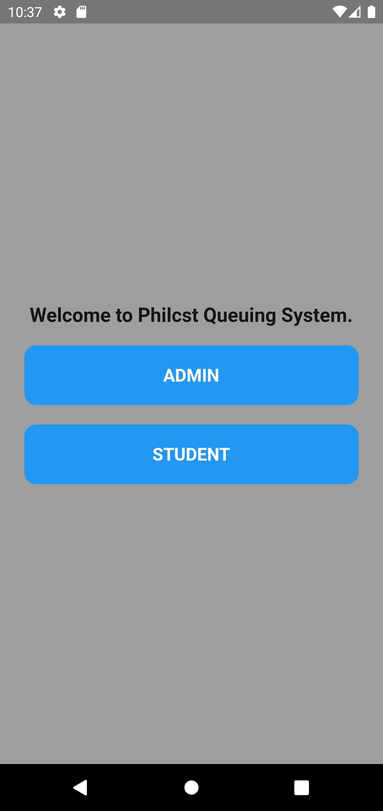
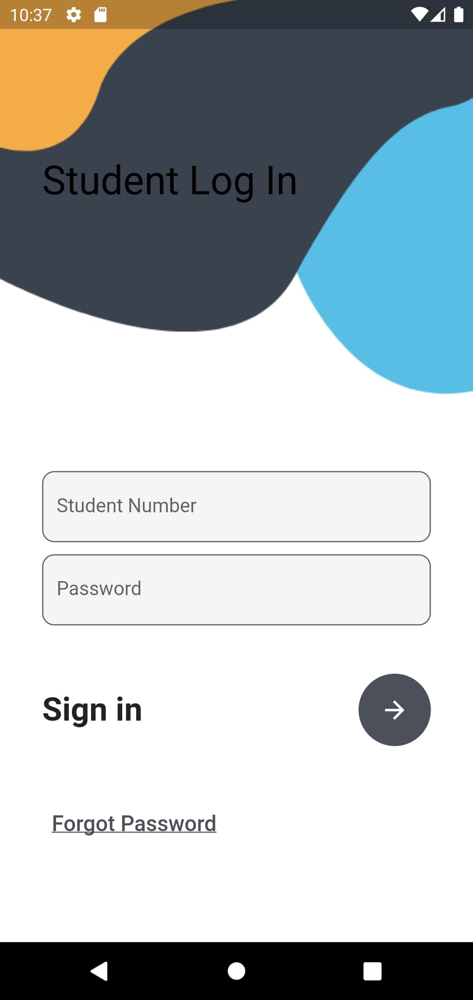
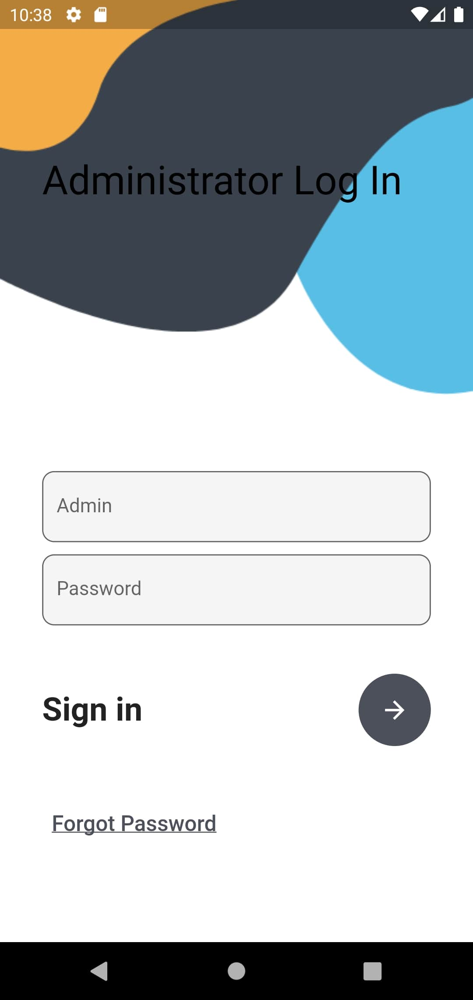
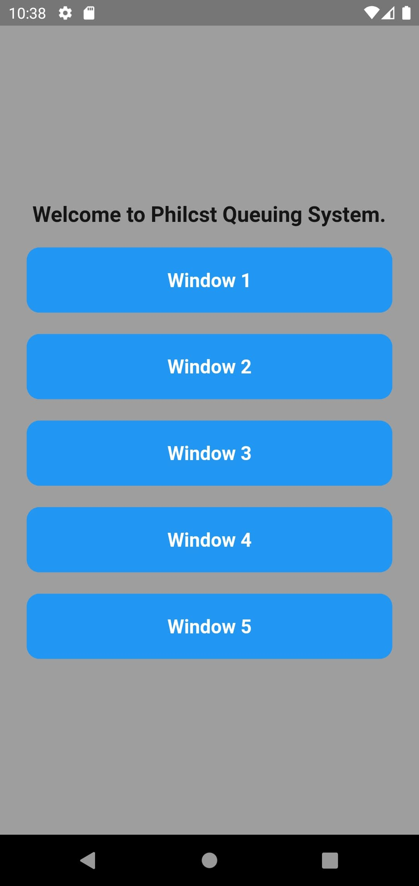

# Beautiful Login Page In Flutter

Create a login page and dashboard for queuing system in flutter.

This amazing app is provided in open source. So, helpful contributions are highly appreciated.

## ScreenShots

|  |   |   |   |   |

### :heart: Found this project useful?

If you found this project useful, then please consider giving it a :star: on Github and Follow me on my Social media account.

## Project Created & Maintained By

### Calachan Jovet, N.

## Getting Started

This project is a starting point for a Flutter application.

- clone repo and setup dart plugin

